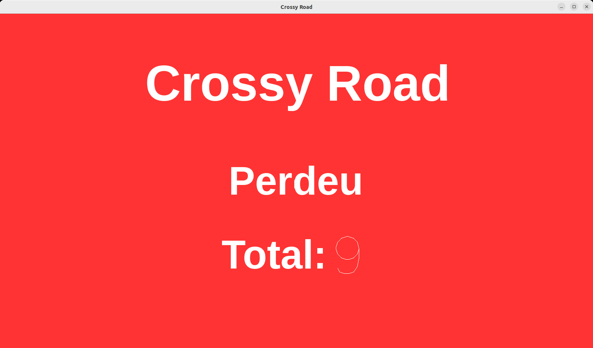

# Crossy Road 🐔
## Projeto de LI1

Jogo desenvolvido em Haskell por nós no âmbito da Unidade Curricular de **Laboratórios de Informática I** (**LI1**) no ano letivo de 2022/2023. Trata-se de uma recriação do famoso jogo **Crossy Road**.

### Nota final: 16/20 ✅


## Como jogar?
### Requisitos:
- Ter o GHC (Glasgow Haskell Compiler) versão 9.6.7 instalado
- Ter o Cabal versão 3.12.1.0 instalado

(Testado apenas com estas versões — outras versões podem não funcionar corretamente.)
### Comandos:
```
git clone git@github.com:a104437ana/LI1.git
```
```
cd LI1
```
```
cabal run
```
Como alternativa ao comando `cabal run`, pode usar o seguinte comando:
```
cabal run 2022li1g030
```
### Teclas:

- Setas (⬆️ ⬇️ ⬅️ ➡️)           
- Enter (⏎)

### Objetivo:

O objetivo do jogo é avançar o máximo possível pelo caminho, tentando alcançar o maior nível antes de morrer.

Para sobreviver, evite ser atropelado por carros ou camiões, não caia ao rio e continue a avançar — o jogo não espera por ninguém!

Não há um fim definido — quanto mais você avançar, maior será o seu recorde.

Boa sorte! 🍀

## Projeto desenvolvido
### Comparação
| O nosso Crossy Road                     | O real Crossy Road                    |
|:-----------------------------:|:------------------------------:|
|      |      |

### Menu inicial

### Um jogo no nível 0

### Menu de pausa

### Um jogo no nível 9

### Mensagem apresentada ao perder um jogo


### Organização do projeto

```
📁 LI1
├── 📁 doc                 # Documentação gerada (ficheiros HTML do Haddock)
├── 📁 imagem              # Imagens necessárias para o jogo correr (carregadas pelo Gloss)
├── 📁 readme              # Imagens utilizadas neste README.md
├── 📁 src                 # Código-fonte principal do jogo (módulos Haskell)
├── 📁 tests               # Testes unitários (usando HUnit)
├── 📄 .gitignore          # Ficheiros e pastas a serem ignorados pelo Git
├── 📄 2022li1g030.cabal   # Ficheiro de configuração do projeto Cabal (dependências, módulos, exec)
├── 📄 Fase1.pdf           # Enunciado da fase 1 do projeto (regras e objetivos)
├── 📄 Fase2.pdf           # Enunciado da fase 2 do projeto (continuação e novas tarefas)
├── 📄 README.md           # Documentação principal do projeto (instruções de uso, requisitos, etc.)
└── 📄 README2.md          # Versão anterior do README.md
```

Este projeto foi dividido em duas fases, tendo cada uma o seu respetivo enunciado: [Fase 1](Fase1.pdf) e [Fase 2](Fase2.pdf).

Este projeto vai além de um jogo, abrangendo testes, documentação, entre outros elementos.

### Documentação

A pasta [doc/html](doc/html) contém a documentação gerada pelo Haddock em formato HTML.

Para a visualizar corretamente, abra o ficheiro [doc/html/index.html](doc/html/index.html) usando o **Live Server** no seu editor (exemplo: VS Code). Isso permite navegar pela documentação corretamente no navegador.

### Testes

Para executar os testes unitários, basta usar o comando:

```
cabal test
```

### Mais informações

Para mais informações ver o [README2.md](README2.md), o README original do trabalho que entregamos.

Este novo README, o [README.md](README.md) que está a ler, foi criado para apresentar melhor o projeto ao mundo e para atualizar algumas informações.

Para poderem experimentar o jogo, fizemos alguns ajustes no código para resolver problemas de compilação, mas mantivemos a essência e o funcionamento original do projeto.

## Autores
### Grupo 30
- [Ana Sá Oliveira](https://github.com/a104437ana) (A104437)
- Sara Campos Ramalho (A72481)