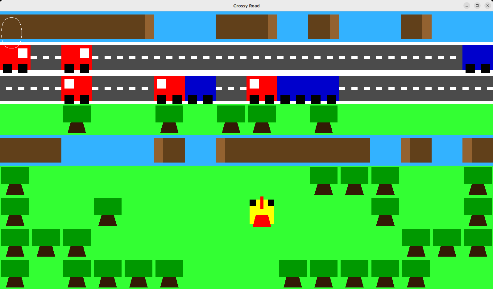
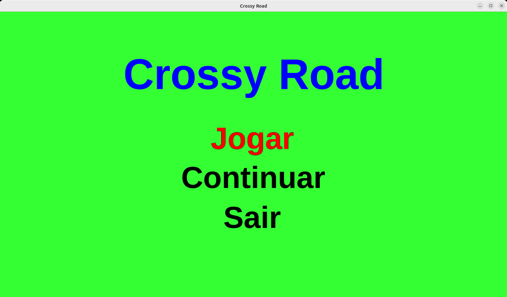
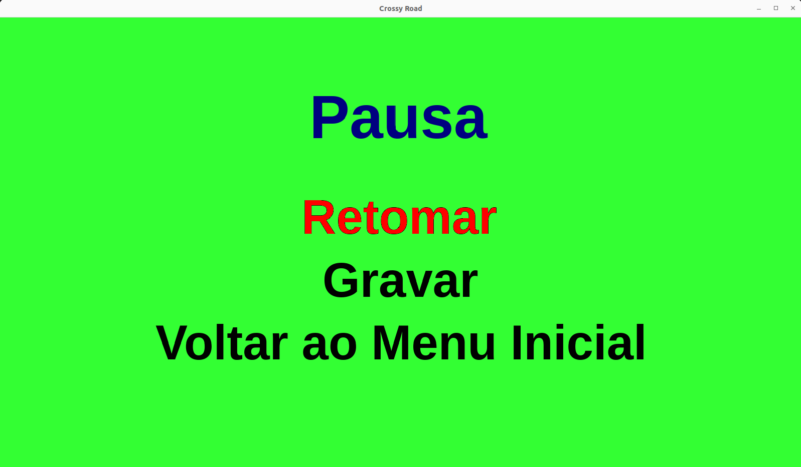
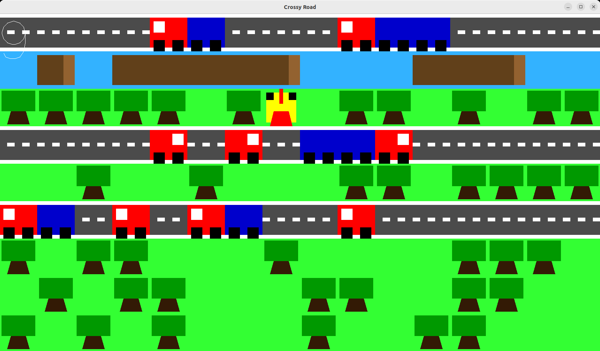

# Crossy Road 🐔
## Projeto de LI1

Jogo desenvolvido em Haskell por nós no âmbito da Unidade Curricular de **Laboratórios de Informática I** (**LI1**) no ano letivo de 2022/2023. Trata-se de uma recriação do famoso jogo **Crossy Road**.

### Nota final: 16/20 ✅



## Como jogar?
### Requisitos:
- Ter o GHC (Glasgow Haskell Compiler) versão 9.6.7 instalado
- Ter o Cabal versão 3.12.1.0 instalado

(Testado apenas com estas versões — outras versões podem não funcionar corretamente.)
### Comandos:
```
git clone git@github.com:a104437ana/LI1.git
```
```
cd LI1
```
```
cabal run
```
Como alternativa ao comando `cabal run`, pode usar o seguinte comando:
```
cabal run 2022li1g030
```
### Teclas:

- Setas (⬆️ ⬇️ ⬅️ ➡️)           
- Enter (⏎)

### Objetivo:

O objetivo do jogo é avançar o máximo possível pelo caminho, tentando alcançar o maior nível antes de morrer.

Não há um fim definido — quanto mais você avançar, maior será o seu recorde.

Boa sorte! 🍀

## Projeto desenvolvido
### Comparação
| O nosso Crossy Road                     | O real Crossy Road                    |
|:-----------------------------:|:------------------------------:|
|      |      |

### Algumas imagens do jogo desenvolvido






### Mais informações

Este projeto foi dividido em duas fases, tendo cada uma o seu respetivo enunciado: [Fase 1](Fase1.pdf) e [Fase 2](Fase2.pdf).

Este projeto vai além de um jogo, abrangendo testes, documentação, entre outros elementos.

Para mais informações ver o [README2.md](README2.md), o README original do trabalho que entregamos.

Este novo README, o [README.md](README.md) que está a ler, foi criado para apresentar melhor o projeto ao mundo e para atualizar algumas informações.

Para poderem experimentar o jogo, fizemos alguns ajustes no código para resolver problemas de compilação, mas mantivemos a essência e o funcionamento original do projeto.

## Autores
### Grupo 30
- [Ana Sá Oliveira](https://github.com/a104437ana) (A104437)
- Sara Campos Ramalho (A72481)